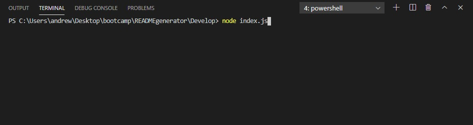
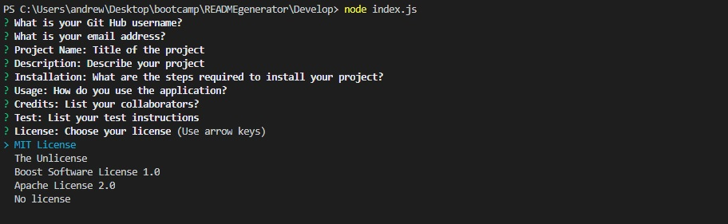
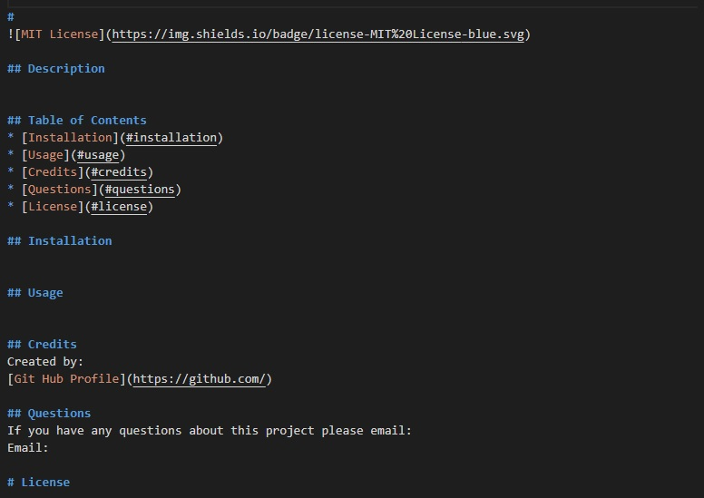

# README Generator


## ```Description```
 The purpose of this project was to create a README generator. 
 
 The goals for this project:

1. Use inquirer to prompt the user through a series of questions
2. create a README template
3. The template should include Description, Table of contents, Usage, Credits, Questions and a license if the user chooses to have one
4. Each answered question will be added to the README template
5. Once all the questions have been answered a README will be generated

 

## ```Table of Contents```
* [Installation](#installation)
* [Usage](#usage)
* [Credits](#credits)
* [Questions](#questions)
* [License](#license)

## ```Installation```
Copy the READMEgenerator repository.

## ```Usage```
1. Open index.js with terminal and run node index.js



2. The user will be prompted with questions one by one. In this case I passed empty responses into the questions to show them all.



3. After all the questions have been answered a generated README will appear in the Develop folder with all inputs to the questions



## ```Credits```
Created by: Andrew Boyle

[Git Hub Profile](https://github.com/Andyb2)

## ```Questions```
If you have any questions about this project please email:
a.michael.boyle@gmail.com

# ```License```

MIT License

    Copyright (c) [year] [fullname]

    Permission is hereby granted, free of charge, to any person obtaining a copy
    of this software and associated documentation files (the "Software"), to deal
    in the Software without restriction, including without limitation the rights
    to use, copy, modify, merge, publish, distribute, sublicense, and/or sell
    copies of the Software, and to permit persons to whom the Software is
    furnished to do so, subject to the following conditions:

    The above copyright notice and this permission notice shall be included in all
    copies or substantial portions of the Software.

    THE SOFTWARE IS PROVIDED "AS IS", WITHOUT WARRANTY OF ANY KIND, EXPRESS OR
    IMPLIED, INCLUDING BUT NOT LIMITED TO THE WARRANTIES OF MERCHANTABILITY,
    FITNESS FOR A PARTICULAR PURPOSE AND NONINFRINGEMENT. IN NO EVENT SHALL THE
    AUTHORS OR COPYRIGHT HOLDERS BE LIABLE FOR ANY CLAIM, DAMAGES OR OTHER
    LIABILITY, WHETHER IN AN ACTION OF CONTRACT, TORT OR OTHERWISE, ARISING FROM,
    OUT OF OR IN CONNECTION WITH THE SOFTWARE OR THE USE OR OTHER DEALINGS IN THE
    SOFTWARE.
  